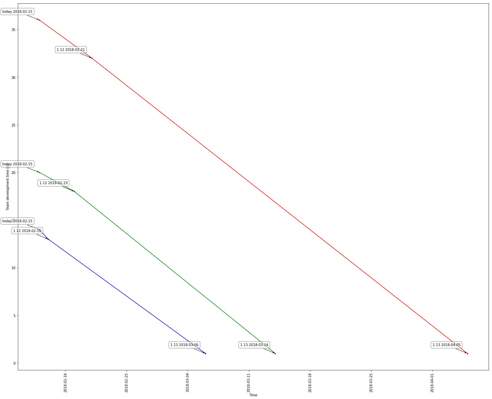

# Jira And Python For Managers
Ideas on how to use Jira with Python 

# Posts:
* [How to improve your velocity estimation with machine learning methods?](https://robert-krasinski.github.io/JiraAndPythonForManagers/How%20to%20improve%20your%20velocity%20estimation%20with%20machine%20learning%20methods_.html)
* [Prediction intervals in Agile forecasting¶](https://robert-krasinski.github.io/JiraAndPythonForManagers/Prediction%20intervals%20in%20Agile%20forecasting.html)
* [Backlog health score](https://robert-krasinski.github.io/JiraAndPythonForManagers/Backlog%20health%20score-Extended%20version%20for%20blog.html)
* [Epic development cost estimation](https://robert-krasinski.github.io/JiraAndPythonForManagers/Epic%20costs%20estimation%20-%20extended%20version%20for%20blog.html)

# Install Jupyter notebook
http://jupyter.readthedocs.io/en/latest/install.html

# Clone repository on your machine
https://help.github.com/articles/cloning-a-repository/

# Set up Jira credentials
https://gist.github.com/robert-krasinski/c677a470a11050355617ca1f0822a37b

# Run
Execute: 'jupyter notebook' command from cloned repository folder

